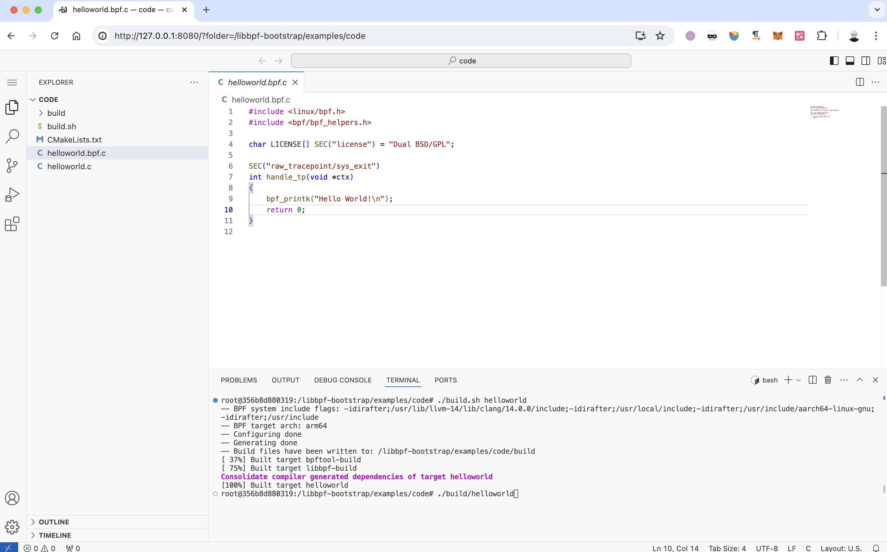

Docker container for compiling static eBPF applications with [libbpf-bootstrap](https://github.com/libbpf/libbpf-bootstrap).

Usage:

1. Put code files in directory `/code` , such as `helloworld.bpf.c` and `helloworld.c`
2. Modify the environment variable `PROGRAM_NAME` in the `docker-compose.yml` file, such as `helloworld`
3. Run command: `docker compose up libbpf-bootstrap`, the program will be automatically compiled

Alternatively, you can use the following command to start a remote eBPF compilation test environment that can be accessed through the browser:

`docker compose up code-server`

